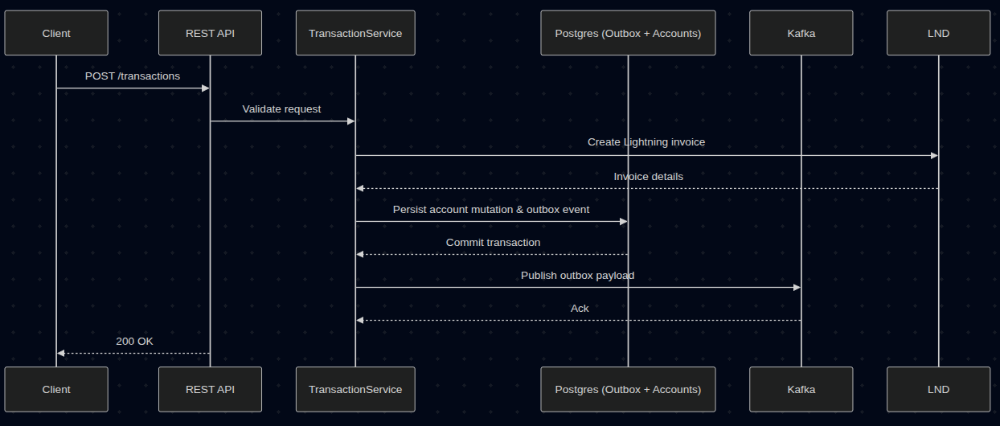

# Aratiri 🗲

A multi-user Bitcoin Lightning and on-chain middleware platform.

## Purpose 
Aratiri is meant for institutions and platforms that already safeguard their users' funds and want to integrate Bitcoin and Lightning capabilities into their existing financial architecture. You remain the custodian of your users' bitcoin. Aratiri facilitates the interactions with the Bitcoin network. Aratiri is not a self-custodial wallet.

## Features
- Multi-user authentication
- LNURL invoice generation
- Internal/external Lightning routing
- On-chain settlement
- Pay to nostr npub and nip-05 addresses

## Getting Started
###  Requirements
* LND Node (mainnet or testnet)
* Java 21
* Docker (optional)
* Access to your node's admin macaroon and TLS cert.

### Setup
#### 1. Export your LND admin macaroon
Aratiri authenticates with your Lightning node using your admin macaroon.
Convert it to a hex string and save the output in `secrets/admin.macaroon`:
```bash
  xxd -p ~/.lnd/data/chain/bitcoin/mainnet/admin.macaroon | tr -d '\n'
```
#### 2. Configure application secrets and environment
Populate the `secrets/` directory with the credentials Aratiri expects at runtime:

| Secret | Description |
| --- | --- |
| `secrets/admin.macaroon` | Hex-encoded admin macaroon from your Lightning node |
| `secrets/tls.cert` | TLS certificate for your Lightning node's gRPC endpoint |

#### 3. Launch supporting services and start Aratiri
If you prefer containers, start the Postgres, Kafka (KRaft), and Aratiri services with Docker Compose:

```bash
docker compose --profile full-stack up --build -d
```

Once the service starts, generated OpenAPI documentation is available at `/swagger-ui.html`

### Transactional flow


### Shortcuts
- [Docker Compose stack](docker-compose.yml)
- [Application configuration](aratiri-app/src/main/resources/application.yml)
- [Core domain module](aratiri-core)
- [Trusted issuer local testing guide](docs/trusted-issuers-local-testing.md)
