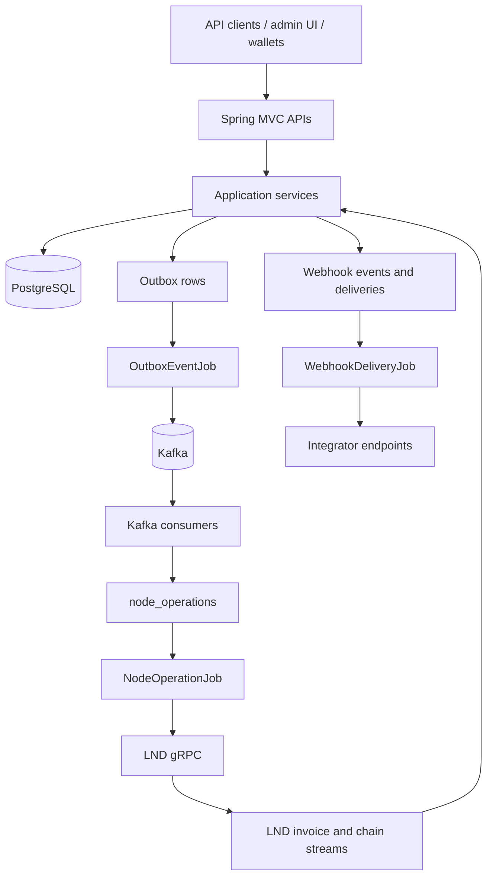
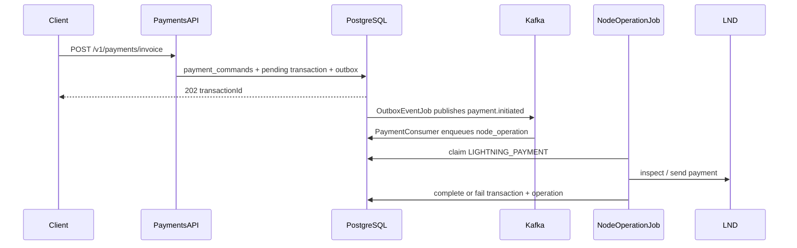

# Aratiri

Aratiri is a Spring Boot service that gives a custodial platform a Bitcoin Lightning and on-chain API surface without making Aratiri the custodian. The platform that embeds Aratiri still owns user balances and user relationships. Aratiri owns the operational bridge to LND, the user-facing payment APIs, the internal ledger projection, asynchronous payment execution, LNURL support, webhook delivery, and node administration.

This README focuses on how the application works. Operational setup lives in:

- [Running Aratiri](docs/running.md)
- [Configuration Reference](docs/configuration.md)
- [Trusted Issuer Local Testing](docs/trusted-issuers-local-testing.md)
- [Postman Collection](postman/README.md)

## System Shape

Aratiri is a modular monolith. The HTTP controllers are thin adapters over application ports. Domain/application services write durable intent into PostgreSQL first, then use a transactional outbox and Kafka to drive side effects. LND calls are not made directly from most API request paths; they are retried by durable workers through `node_operations`.

```mermaid
flowchart TB
    clients["API clients / admin UI / wallets"] --> http["Spring MVC APIs"]
    http --> app["Application services"]
    app --> db[("PostgreSQL")]
    app --> outbox["Outbox rows"]
    outbox --> outboxJob["OutboxEventJob"]
    outboxJob --> kafka[("Kafka")]
    kafka --> consumers["Kafka consumers"]
    consumers --> operations["node_operations"]
    operations --> nodeJob["NodeOperationJob"]
    nodeJob --> lnd["LND gRPC"]
    lnd --> listeners["LND invoice and chain streams"]
    listeners --> app
    app --> webhooks["Webhook events and deliveries"]
    webhooks --> webhookJob["WebhookDeliveryJob"]
    webhookJob --> integrators["Integrator endpoints"]
```

The key design point is separation of concerns:

- HTTP requests validate identity and record intent.
- PostgreSQL stores user state, append-only accounting facts, outbox events, payment idempotency keys, node operation state, and webhook delivery state.
- Kafka carries committed domain events to consumers.
- `node_operations` owns long-running or ambiguous LND side effects.
- Scheduled jobs retry publish, node execution, reconciliation, webhook delivery, stream reconnects, and optional peer management.

## Runtime Modules

The source tree is organized by bounded area under `src/main/java/com/aratiri`.

| Area | Responsibility |
| --- | --- |
| `auth` | Local auth, Google SSO, trusted issuer token exchange, refresh tokens, password reset, user provisioning, WebSocket notification identity. |
| `accounts` | One account per user, LNURL alias, node-owned on-chain deposit address, QR payloads, fiat-denominated balance views. |
| `invoices` | Creates LND invoices, persists local invoice records, decodes payment requests, emits invoice-created webhooks. |
| `payments` | Idempotent Lightning, LNURL, and on-chain payment commands. Creates pending debit transactions and emits payment intent events. |
| `transactions` | Transaction read model, append-only lifecycle events, settlement processors, account ledger updates, payment succeeded/failed events. |
| `lnurl` | Public LNURL-pay metadata/callback endpoints and authenticated LNURL-pay execution. |
| `decoder` | Resolves LNURL, Lightning invoices, on-chain addresses, internal aliases, Lightning addresses, npub, and NIP-05 identifiers. |
| `webhooks` | Builds idempotent webhook events, subscribes endpoints to event types, signs and retries deliveries. |
| `admin` | LND node administration, channel and peer operations, wallet/node stats, node settings, node operation visibility. |
| `infrastructure` | JPA entities/repositories, Kafka, gRPC stubs, scheduling, filters, security, CORS, cache, WebSocket, and shared runtime configuration. |

Most modules follow a ports-and-adapters style: API classes call `application.port.in` interfaces, application services call `application.port.out` interfaces, and infrastructure adapters implement those ports with JPA repositories, LND gRPC clients, Kafka, HTTP clients, or external APIs.

## Core Data Model

Aratiri's money model is intentionally append-oriented.

- `users` and `accounts` represent identities and the single account attached to each user.
- `transactions` represent user-visible money movement intent and expose denormalized `current_*` fields for fast reads.
- `transaction_events` records lifecycle facts such as `PENDING`, `COMPLETED`, `FAILED`, and `FEE_ADDED`.
- `account_entries` is the append-only ledger. Each balance-affecting settlement appends a delta and resulting `balance_after`.
- `lightning_invoices` links LND invoices to Aratiri users, metadata, external references, payment hashes, and settlement state.
- `outbox_events` stores committed domain events before Kafka publication.
- `payment_commands` stores HTTP idempotency state by user and idempotency key.
- `node_operations` stores durable LND side-effect work with leases, attempts, external IDs, and unknown-outcome state.
- `webhook_events` and `webhook_deliveries` store integrator callbacks and retry state.

This means retries should be safe at each layer: duplicate domain events are keyed, ledger entries are idempotent per account/transaction, routing fee events are unique per transaction, payment commands replay accepted responses, and node operations are claimed with leases.

## Payment Lifecycle

### External Lightning Payment

1. A client calls `POST /v1/payments/invoice` with an `Idempotency-Key`.
2. `PaymentsAdapter` decodes the BOLT11 invoice, rejects already-paid or in-flight payment hashes, creates a pending `LIGHTNING_DEBIT` transaction, and writes a `payment.initiated` outbox event.
3. `OutboxEventJob` publishes the event to Kafka.
4. `PaymentConsumer` turns the Kafka message into a `LIGHTNING_PAYMENT` row in `node_operations`.
5. `NodeOperationJob` claims the operation, checks LND for existing payment state, then calls `Router.SendPaymentV2` through `LightningNodeClientAdapter`.
6. On success, the worker records routing fee if present, confirms the transaction, appends a debit ledger entry, marks the operation succeeded, and emits payment/webhook/notification events.
7. On terminal failure, it fails the transaction and marks the node operation failed.
8. On ambiguous transport failure or nonterminal LND state, it retries until the configured attempt limit. If Aratiri cannot prove the final LND outcome, it records `UNKNOWN_OUTCOME` and emits `node_operation.unknown_outcome`.

```mermaid
sequenceDiagram
    participant Client
    participant API as PaymentsAPI
    participant DB as PostgreSQL
    participant Kafka
    participant Worker as NodeOperationJob
    participant LND

    Client->>API: POST /v1/payments/invoice
    API->>DB: payment_commands + pending transaction + outbox
    DB-->>Client: 202 transactionId
    DB->>Kafka: OutboxEventJob publishes payment.initiated
    Kafka->>DB: PaymentConsumer enqueues node_operation
    Worker->>DB: claim LIGHTNING_PAYMENT
    Worker->>LND: inspect / send payment
    Worker->>DB: complete or fail transaction + operation
```

### Internal Lightning Transfer

If the payment hash belongs to an invoice generated by Aratiri, the payment is treated as an internal transfer instead of routing through LND:

1. The sender gets a pending `LIGHTNING_DEBIT` transaction.
2. An `internal.transfer.initiated` event is published.
3. `InternalTransferConsumer` settles the sender debit and creates a receiver `LIGHTNING_CREDIT`.
4. The internal invoice is marked settled locally.
5. A follow-up event cancels the LND invoice so it cannot also be paid externally.
6. Sender and receiver notifications are emitted.

### On-Chain Withdrawal

`POST /v1/payments/onchain` follows the same idempotency and outbox pattern. The API estimates network and platform fees, creates a pending `ONCHAIN_DEBIT`, and emits `onchain.payment.initiated`. The node worker calls LND `SendCoins`, records the txid as `external_id`, confirms the transaction, and debits the ledger.

### Incoming Funds

Incoming Lightning and on-chain credits come from LND streams.

- `LightningListener` subscribes to LND invoices from the stored add/settle cursor. Settled local invoices update `lightning_invoices`, then emit `invoice.settled`.
- `InvoiceSettledConsumer` creates or reuses the matching `LIGHTNING_CREDIT` settlement and appends the account ledger credit.
- `OnChainTransactionListener` subscribes to LND chain transactions from the stored block-height cursor. Confirmed outputs to account deposit addresses emit `onchain.transaction.received`.
- `OnChainTransactionConsumer` settles `ONCHAIN_CREDIT` transactions by tx hash and output index.

## API Surface

| API | Main purpose |
| --- | --- |
| `/v1/auth` | Login, registration verification, Google SSO, refresh, token exchange, logout, password reset, current user. |
| `/v1/accounts` | Current account, account lookup, account creation, legacy date-range transaction list. |
| `/v1/invoices` | Authenticated invoice creation and invoice decode. |
| `/v1/payments` | Idempotent Lightning and on-chain payment initiation plus on-chain fee estimates. |
| `/v1/transactions` | User-scoped transaction reads with cursor pagination and admin-only manual confirmation. |
| `/.well-known/lnurlp/{alias}` and `/lnurl/callback/{alias}` | Public LNURL-pay metadata and callback endpoints. |
| `/v1/lnurl/pay` | Authenticated LNURL-pay execution. |
| `/v1/decoder` | Unified decoding/resolution endpoint. |
| `/v1/general-data` | Supported fiat currencies and cached BTC price data. |
| `/v1/admin` | Admin-only LND node, channel, peer, wallet, settings, stats, and node operation endpoints. |
| `/v1/admin/webhooks` | Admin webhook endpoint management. |
| `/v1/admin/webhook-deliveries` | Webhook delivery inspection and manual retry. |
| `/v1/notifications/subscribe` | WebSocket notification stream using a JWT in the query string. |

OpenAPI is generated at `/swagger-ui.html` only when API docs are explicitly enabled with `ARATIRI_SECURITY_API_DOCS_ENABLED=true`.
The H2 console is only permitted in `dev`, `development`, or `test` profiles unless `aratiri.security.dev-endpoints.h2-console-enabled=true` is set explicitly.

## Webhook Model

Webhook events are created from application facts, not directly from Kafka offsets. Each event has a deterministic `event_key` when possible, so duplicate processing does not create duplicate callbacks. Admin users create endpoints, select event types, rotate signing secrets, send test events, and inspect deliveries.

Supported event families include:

- `invoice.created`
- `invoice.settled`
- `payment.accepted`
- `payment.succeeded`
- `payment.failed`
- `onchain.deposit.confirmed`
- `account.balance_changed`
- `node_operation.unknown_outcome`
- `webhook.test`

Deliveries are signed with `X-Aratiri-Signature` using HMAC-SHA256 over `timestamp.eventId.payload`. `WebhookDeliveryJob` claims due deliveries, sends them without following redirects, records response status/body, and retries with backoff until max attempts.

## Reliability Boundaries

Aratiri has three separate retry boundaries:

1. **Outbox publication** retries database-to-Kafka publication until `processed_at` is written.
2. **Node operations** retry LND side effects with leases and status inspection, then surface unknown outcomes instead of pretending success or failure.
3. **Webhook delivery** retries outbound HTTP callbacks independently of the core payment flow.

`TransactionReconciliationJob` also scans older pending Lightning transactions and compares them with LND payment state. This provides a repair path if a payment result was missed by the normal worker path.

## Security Model

The app is stateless at the HTTP layer and uses Spring Security as an OAuth2 resource server. It can validate locally issued HMAC JWTs and configured trusted issuer JWTs through a chained decoder.

Authentication flows include:

- local email/password login with refresh tokens,
- registration and password reset verification codes delivered by email,
- Google SSO provisioning,
- trusted issuer token exchange for integrators,
- role hierarchy `SUPERADMIN > ADMIN > VIEWER > USER`.

Public routes are limited to login/registration/reset, Google SSO, token refresh/exchange, LNURL metadata/callbacks, Swagger, H2 console, and notification WebSocket handshake. Admin controllers use method security with admin roles.

## External Dependencies

Aratiri expects:

- LND gRPC with admin macaroon credentials,
- PostgreSQL with Flyway-managed schema,
- Kafka for asynchronous domain events,
- SMTP for verification and password reset email,
- optional Google OAuth verification,
- optional Nostr relay and NIP-05/LUD16 lookups,
- external BTC price APIs with fallback pricing.

Generated LND protobuf classes are built from `src/main/proto` and packaged into the Spring Boot jar. The Gradle build includes a verification task to ensure the generated `lnrpc`, `routerrpc`, and `invoicesrpc` classes are present in the boot jar.

## License

This project is licensed under the MIT License — see [LICENSE](LICENSE) for details.
