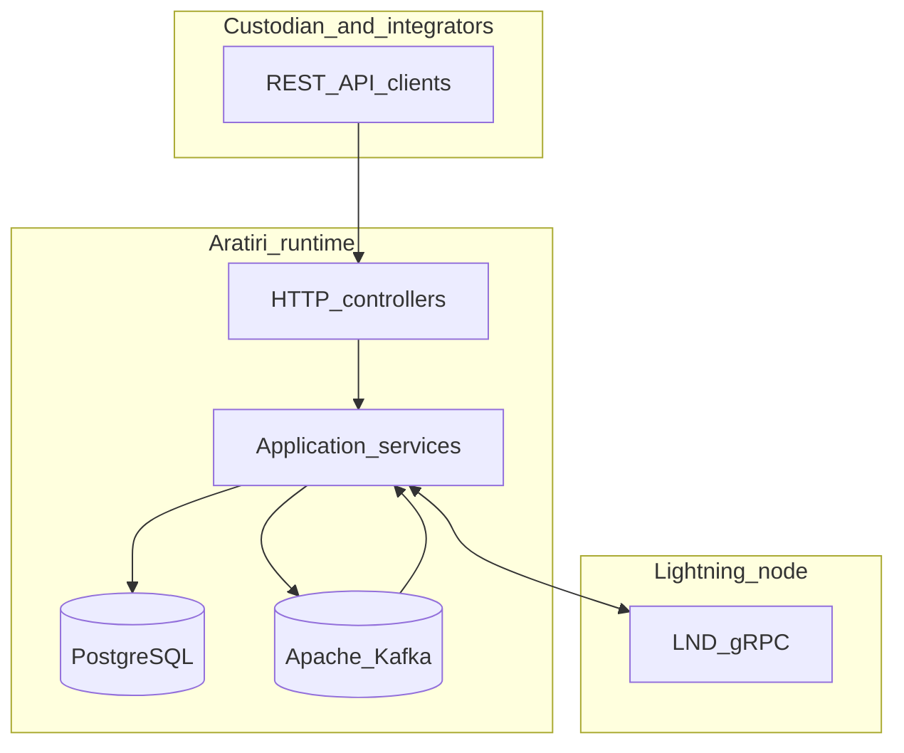
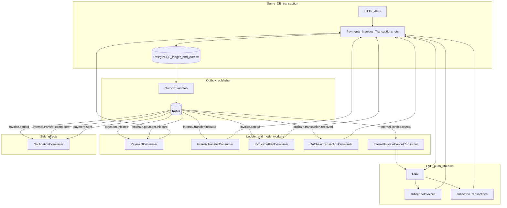

# Aratiri 🗲

A multi-user Bitcoin Lightning and on-chain middleware platform.

## Purpose

Aratiri is meant for institutions and platforms that already safeguard their users' funds and want to integrate Bitcoin and Lightning capabilities into their existing financial architecture. You remain the custodian of your users' bitcoin. Aratiri facilitates the interactions with the Bitcoin network. Aratiri is not a self-custodial wallet.

## Features
- Multi-user authentication
- LNURL invoice generation
- Internal/external Lightning routing
- On-chain settlement
- Pay to nostr npub and nip-05 addresses

## Getting Started
###  Requirements
* LND Node (mainnet or testnet)
* Java 25
* Docker (optional)
* Access to your node's admin macaroon and TLS cert.
* PostgreSQL

### Setup
#### 1. Export your LND admin macaroon
Aratiri authenticates with your Lightning node using your admin macaroon.
Convert it to a hex string and save the output in `secrets/admin.macaroon`:
```bash
  xxd -p ~/.lnd/data/chain/bitcoin/mainnet/admin.macaroon | tr -d '\n'
```
#### 2. Configure application secrets and environment
Populate the `secrets/` directory with the credentials Aratiri expects at runtime:

| Secret | Description |
| --- | --- |
| `secrets/admin.macaroon` | Hex-encoded admin macaroon from your Lightning node |
| `secrets/tls.cert` | TLS certificate for your Lightning node's gRPC endpoint |

#### 3. Launch supporting services and start Aratiri
If you prefer containers, start the Postgres, Kafka (KRaft), and Aratiri services with Docker Compose:

```bash
docker compose --profile full-stack up --build -d
```

Once the service starts, generated OpenAPI documentation is available at `/swagger-ui.html`

#### 4. Local Gradle build and run (recommended)
When running locally, use Gradle outputs from `build/` so generated protobuf classes are always on the runtime classpath.

```bash
./gradlew clean build
java -jar build/libs/<artifact>.jar
```

You can also run directly with:

```bash
./gradlew bootRun
```

Avoid running from `target/` or IDE compiler outputs. Aratiri uses Gradle build artifacts, and mixing output folders can cause runtime `ClassNotFoundException`/`NoClassDefFoundError` for generated proto/grpc classes.

#### 5. IDE setup for local development
- Build and run using Gradle.
- Run tests using Gradle.

### Transactional flow

Aratiri sits between **your** custody layer and **LND**: HTTP APIs record intent and money movement in PostgreSQL first. Side effects that must not be lost (calling LND, notifying users) are deferred using an **outbox** row in the same database transaction, then published to **Kafka** on a schedule so workers can retry independently. Some Kafka topics are also read by a **notification** consumer for email-side effects, not only for ledger updates.

#### System context


```mermaid
flowchart TB
  subgraph custodian [Custodian_and_integrators]
    clients[REST_API_clients]
  end
  subgraph aratiri [Aratiri_runtime]
    apis[HTTP_controllers]
    core[Application_services]
    data[(PostgreSQL)]
    bus[(Apache_Kafka)]
    clients --> apis
    apis --> core
    core --> data
    core --> bus
    bus --> core
  end
  subgraph node [Lightning_node]
    lnd[LND_gRPC]
  end
  core <--> lnd
```

#### Outbox pattern and topics


```mermaid
flowchart TB
  subgraph writes [Same_DB_transaction]
    httpApis[HTTP_APIs]
    adapters[Payments_Invoices_Transactions_etc]
    pg[(PostgreSQL_ledger_and_outbox)]
    httpApis --> adapters
    adapters --> pg
  end

  subgraph lndStreams [LND_push_streams]
    lndNode[LND]
    invoiceStream[subscribeInvoices]
    chainStream[subscribeTransactions]
    lndNode --> invoiceStream
    lndNode --> chainStream
    invoiceStream --> adapters
    chainStream --> adapters
  end

  subgraph publish [Outbox_publisher]
    outboxJob[OutboxEventJob]
    kafkaBus[(Kafka)]
    pg --> outboxJob
    outboxJob --> kafkaBus
  end

  subgraph ledgerConsumers [Ledger_and_node_workers]
    paymentCons[PaymentConsumer]
    internalCons[InternalTransferConsumer]
    settledCons[InvoiceSettledConsumer]
    onchainCons[OnChainTransactionConsumer]
    cancelCons[InternalInvoiceCancelConsumer]
  end

  subgraph sideEffects [Side_effects]
    notifyCons[NotificationConsumer]
  end

  kafkaBus -->|payment.initiated| paymentCons
  kafkaBus -->|onchain.payment.initiated| paymentCons
  kafkaBus -->|internal.transfer.initiated| internalCons
  kafkaBus -->|invoice.settled| settledCons
  kafkaBus -->|onchain.transaction.received| onchainCons
  kafkaBus -->|internal.invoice.cancel| cancelCons
  kafkaBus -->|invoice.settled| notifyCons
  kafkaBus -->|internal.transfer.completed| notifyCons
  kafkaBus -->|payment.sent| notifyCons

  paymentCons --> adapters
  internalCons --> adapters
  settledCons --> adapters
  onchainCons --> adapters
  cancelCons --> lndNode
  adapters --> lndNode
```

Topic names match [`KafkaTopics`](src/main/java/com/aratiri/infrastructure/messaging/KafkaTopics.java) in the codebase.

### Shortcuts
- [Docker Compose stack](docker-compose.yml)
- [Application configuration](src/main/resources/application.yml)
- [Trusted issuer local testing guide](docs/trusted-issuers-local-testing.md)
